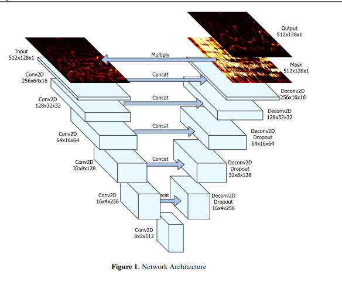
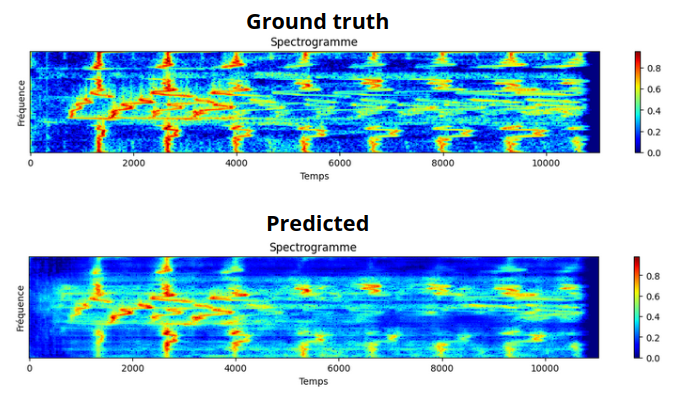
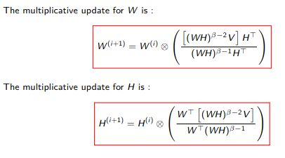
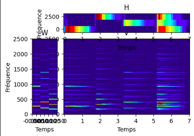
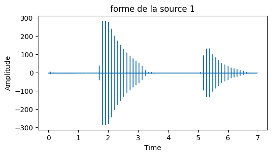
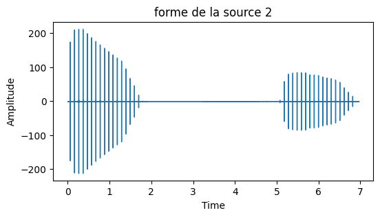

# Advanced Sound Processing practicals

These 2 projects were carried out as part of the Advanced Sound Processing course.

The repo contains 2 folders. 


- ```work1``` : The first is the implentation of __the UNet network__ for the separation of sung voices. The deep learning library used is Tensorflow

-  ```work2``` : The  second one is the implementation of the __NMF factorization__ for sound source localization

Subjects are given in pdf. The codes are provided in the form of annotated notebooks (Jupyter, French)


### Work 1 : Separation of sung voices using Deep Learning

From the article https://openaccess.city.ac.uk/id/eprint/19289/1/


Implementation of the U-NET :






__RESULTS__ : See (or listen) ```work1/results```
<audio src="work1/r%C3%A9sultat/mix/1-radiohead.mp3" controls title="Title"></audio>


### Work 2 : NMF or Nonnegative Matrix Factorization
The goal is to separate sound sources using activation dictionnary
Using this update rule :



__Result__



We can see that we managed to separate the 3 sources (piano key)





